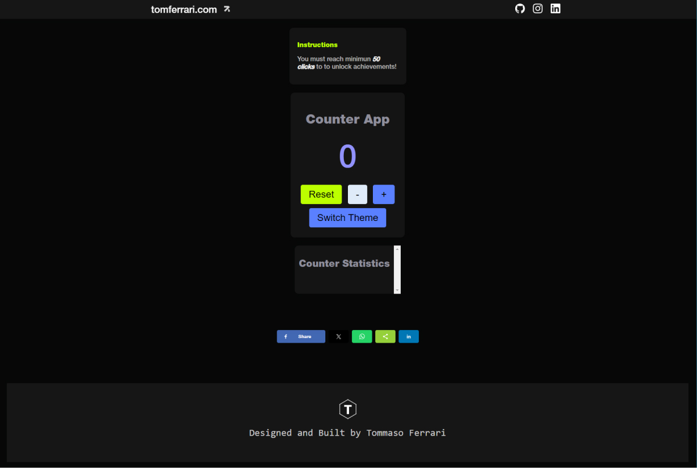

# Counter App

A web-based counter application with achievements and social sharing features.

## Table of Contents

- [Features](#features)
- [Usage](#usage)
- [License](#license)

## Features

- Interactive counter with increment and decrement buttons.
- Achievements system with notifications for reaching milestones.
- Theme switcher to change the app's appearance.
- Social sharing buttons for easy sharing on various platforms.
- Footer with links to your website and social profiles.
- Live chat functionality for real-time communication.
- Contact form for user feedback and inquiries.
- Open Graph metadata for better link previews when sharing on social media.

## Usage

Just start to press buttons and reach the 50 clicks badge!

## License

This project is licensed under the TommasoFerrari.License and its ownership is limited to Tommaso Ferrari.

